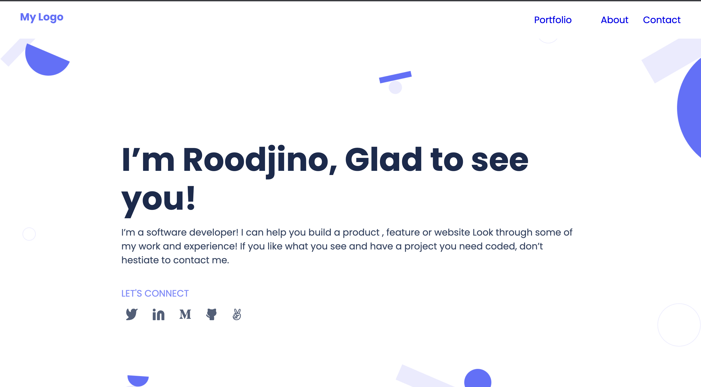

<a name="readme-top"></a>

<div align="center">

  
  <br/>

  <h2><b>Porfolio Website of Rooddjino Cherilus</b></h2>

</div>

<!-- TABLE OF CONTENTS -->

# 📗 Table of Contents

- [📖 About the Project](#about-project)
  - [🛠 Built With](#built-with)
    - [Tech Stack](#tech-stack)
    - [Key Features](#key-features)
  - [🚀 Live Demo](#live-demo)
- [💻 Getting Started](#getting-started)
  - [Setup](#setup)
  - [Prerequisites](#prerequisites)
  - [Install](#install)
  - [Usage](#usage)
  - [Run tests](#run-tests)
  - [Deployment](#triangular_flag_on_post-deployment)
- [👥 Authors](#authors)
- [🔭 Future Features](#future-features)
- [🤝 Contributing](#contributing)
- [⭐️ Show your support](#support)
- [🙏 Acknowledgements](#acknowledgements)
- [❓ FAQ (OPTIONAL)](#faq)
- [📝 License](#license)

<!-- PROJECT DESCRIPTION -->

# 📖 [your_project_name] <a name="about-project"></a>


**[your_project__name]** is a...

## 🛠 Built With <a name="built-with"></a>

### Tech Stack <a name="tech-stack"></a>

A personal Portofolio Website with only basic background information, contact information, and a project showcase.

<!-- Features -->

### Key Features <a name="key-features"></a>

> Features:

- **[Fully Responsive]**
- **[Project Showcase rendered dynammically with Javascript]**

<p align="right">(<a href="#readme-top">back to top</a>)</p>

<!-- LIVE DEMO -->

## 🚀 Live Demo <a name="live-demo"></a>


- [Live Demo Link](https://roodjinocherilus.github.io/Porfolio-Roodjino-Cherilus/)

<p align="right">(<a href="#readme-top">back to top</a>)</p>

<!-- GETTING STARTED -->

## 💻 Getting Started <a name="getting-started"></a>


To get a local copy up and running, follow these steps.

### Prerequisites

In order to run this project you need:

Git Bash , Node JS

### Setup

Clone this repository to your desired folder:

<!--
Example commands:

```sh
  cd my-folder
  git clone git@github.com:myaccount/my-project.git
```
--->
Open Git Bash and run git clone https://github.com/roodjinocherilus/Portfolio-mobile-version-skeleton.git


### Install

Install this project with:

<!--
Example command:

```sh
  cd my-project
  gem install
```
--->

### Usage

To run the project, execute the following command:

<!--
Example command:

```sh
  rails server
```
--->

Run npm install in the folder Portfolio-mobile-version-skeleton


### Run tests

To run tests, run the following command:
Run npx stylelint "**/*.{css,scss}"

### Deployment

You can deploy this project using:
- Github Pages

<p align="right">(<a href="#readme-top">back to top</a>)</p>

<!-- AUTHORS -->

## 👥 Authors <a name="authors"></a>


👤 **Author1**

- GitHub: [@roodjinocherilus](hhttps://github.com/roodjinocherilus)
- Twitter: [@twitterhandle](https://twitter.com/roodjinocherilu)
- LinkedIn: [LinkedIn](https://www.linkedin.com/in/roodjinocherilus/)


<p align="right">(<a href="#readme-top">back to top</a>)</p>

<!-- CONTRIBUTING -->

## 🤝 Contributing <a name="contributing"></a>

Contributions, issues, and feature requests are welcome!

Feel free to check the [issues page](../../issues/).

<p align="right">(<a href="#readme-top">back to top</a>)</p>

<!-- SUPPORT -->

## ⭐️ Show your support <a name="support"></a>

If you like this project...

<p align="right">(<a href="#readme-top">back to top</a>)</p>

<!-- ACKNOWLEDGEMENTS -->

## 🙏 Acknowledgments <a name="acknowledgements"></a>


I would like to thank...

<p align="right">(<a href="#readme-top">back to top</a>)</p>

<!-- FAQ (optional) -->


<!-- LICENSE -->

## 📝 License <a name="license"></a>

This project is [MIT](./LICENSE) licensed.

_NOTE: we recommend using the [MIT license](https://choosealicense.com/licenses/mit/) - you can set it up quickly by [using templates available on GitHub](https://docs.github.com/en/communities/setting-up-your-project-for-healthy-contributions/adding-a-license-to-a-repository). You can also use [any other license](https://choosealicense.com/licenses/) if you wish._

<p align="right">(<a href="#readme-top">back to top</a>)</p>
